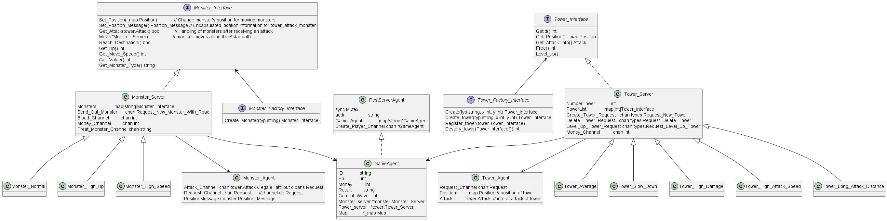
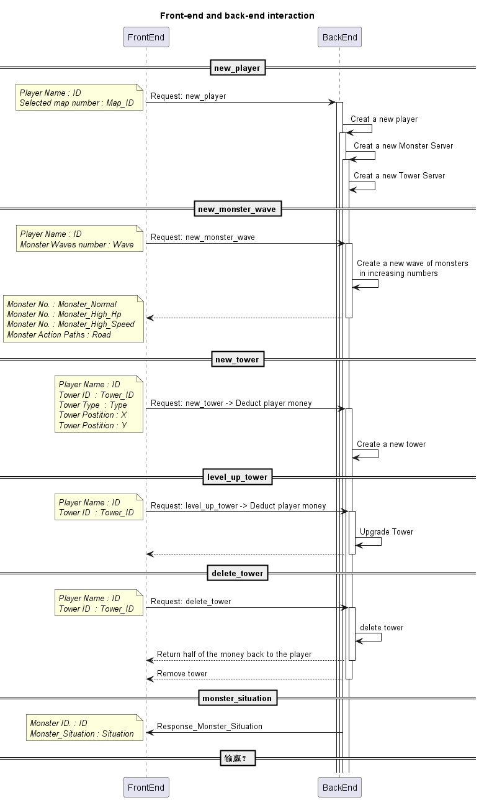

# Défense de la tour

TD2 Groupe2B - Chenyi ZHA, Chenwei MI, Jingwen SUN, Xuanyao HU

## Introduction
Notre projet est un jeu de défense de tour. En bref, nous utilisons **_Vue 3_** pour le front-end et **_go_** pour le back-end. **_Websocket_**, un protocole réseau de la couche application et une interface de programmation, ainsi que **_axios_**, une bibliothèque HTTP, sont utilisés pour l'interaction entre front-end et back-end afin de réaliser ce système multi-agent où tous les tours, tous les monstres et les joueurs sont des agents.

## Partie Ⅰ - Fonctionnement
Le joueur choisit une carte, ce qui est envoyé au backend. Le towerServer et le monsterServer dans le back-end sont opérationnels. A chaque fois que le front-end crée la tour, il envoie une commande au back-end. Le back-end reçoit le nombre de vagues, génère aléatoirement le nombre correspondant de monstres et envoie la commande au front-end. Le front-end puis reçoit la commande et affiche les monstres. Les monstres se déplacent selon l'**_algorithme A*_**, et sont attaqués lorsqu'ils entrent dans le champ d'attaque de la tour. Veuillez noter que les joueurs doivent cliquer le bouton *start* pour appeler la prochaine vague de monstres. Lorsque la vague atteint le maximum et que Hp du joueur > 0, le joueur gagne. Si Hp du joueur = 0, on détermine que le joueur échoue. 

## Partie Ⅱ - Lancement et Architecture
### 2.1 Installation
#### Clonez le code source du projet
```
git clone https://gitlab.utc.fr/michenwe/ia04_tower_defense.git
```
#### Installez node.js 18.12.1 LTS
https://nodejs.org/en/
#### Installez Vue 3
```
npm init vue@latest
```
### 2.2 Lancement
#### Etape 1: Ouvrez votre premier terminal et exécutez Go (back-end)
```
cd <path_of_project>/tower_defense/backend
go run ./main.go
```
Il fonctionne quand "Listening on:8000" apparaît
<br/>
#### Etape 2: Ouvrez votre deuxième terminal et lancez Vite (front-end)
```
 cd <path_of_project>/tower_defense/frontend
 npm install
 npm run dev
```
Il fonctionne quand "VITE" est prêt et le site apparaît.
Attention que s'il existe cette erreur sur "vite" :
 *'Vite' is not an internal or external command, nor is it a runnable program*. Merci de supprimer le fichier "<path_of_project>/tower_defense/frontend/package-lock.json" et puis saisir:
```
 npm i
 npm fund
```
 Réessayez :
 ```
 npm run dev
 ``` 
#### Etape 3: Ouvrez http://localhost:5173/ dans votre navigateur
### 2.3 Brève description de notre architecture
#### 2.3.1 Front-end
L'interface se compose de trois parties principales : 1 boutons (*start*), 3 valeurs (*Money*, *Wave* et *HP*) et 2 couches (*Map*, *Game*). Elle est bien réalisée par **_Vue 3_** en combinaison avec *setup*, un sucre syntaxique.
<br/> 
<br/> 
Tout d'abord, la fonction *initMap* affiche la carte sélectionnée par le joueur. La fonction *dispose* est utilisée pour vider l'interface de jeu de la carte et de tous les événements existants.
Nous présenterons brièvement les deux couches.
<br/> 
<br/> 
Couche «Map»: utilise le *papier.js*, un cadre de script graphique vectoriel à source ouverte, et sert principalement à dessiner la carte, c'est-à-dire à distinguer les chemins où les monstres marchent et les zones où l'on peut construire des tours. Les monstres départent depuis le point de départ dans le coin en haut à gauche. Nous avons lissé la route en calculant le nombre de voisins de chaque point. [Fonctions associées : **_drawRoad_** => **_getRoadPoints_** => **_countNeighbour_** (où “=>” signifie l'appel d'une fonction)].
<br/> 
<br/> 
Couche «Game»: gère les événements liés aux monstres et aux tours.
- Pour les monsters: Nous déplaçons les images de monstres depuis components/icons dont les coordonnées sont envoyés par le front-end, avec leur valeur de sang.
- Pour les tours: Nous créons une "GameLayer" grâce à la fonction "fabric.Canvas". Chaque fois qu'on clique sur cette couche du canevas, il appelle la fonction handleGameLayer pour gérer les événements pertinents. Nous avons réussi à créer un menu de tours à acheter, composé de tours et de leurs valeurs correspondantes en utilisant "fabric.Rect", "fabric.Image", "fabric.Text" et "fabric.Group". Cliquant sur la zone verte, nous pouvons sélectionner la tour à acheter selon le menu. Lorsque l'on clique sur une tour, on peut voir la portée de l'attaque et choisir d'améliorer ou de supprimer cette tour.  [Fonctions associées : **_handleGameLayer_** => **_drawChooseMenu_** => **_drawTower_** => **_showRange_** (=> **_deleteTower_** & **_upgradeTower_**) & **_deleteChooseMenu_** (où “=>” signifie l'appel d'une fonction)].
#### 2.3.2 Back-end
Voici un UML détaillant les classes(C) et interfaces(I).
<br/> 

<br/>
Dans notre projet, nous avons 4 agents au total : **_RestServerAgent_**, **_GameAgent_**, **_MonsterServer_** et **_TowerServer_**.
<br/>
<br/> 
Dans ce cas, le **_RestServerAgent_** a une autorité directe sur tous les **_GameAgents_**. Chaque fois que le back-end reçoit une demande du front-end pour créer un joueur, nous passons les informations de joueur dans le Channel ; le **_RestServerAgent_** écoute constamment le channel **_Create_Player_Channel_**, crée et sauvegarde le joueur dès qu'il reçoit les informations sur le joueur, et déclenche une goroutine **_Player.Run()_**.
<br/>
<br/>
Chaque **_GameAgent_** possède 2 propriétés **_Monster_server_** et **_Tower_server_** pour nous permettre de gérer la gestion des monstres et la gestion des tours. 
<br/>
<br/>
Au niveau de **_MonsterServer_** et **_TowerServer_**, nous nous sommes reposés sur le patron de conception Factory. En même temps, nous avons monté tous les types de monstres et de tours comme **_Monster_Interface_** et **_Tower_Interface_** respectivement. Chaque fois que le back-end reçoit une demande du front-end pour créer une tour ou un monstre etc, on transmet les informations au channel correspondant, et la fonction **_Tower_Server.Run()_** et **_Monster_Server.Run()_** écoutera toujours ces channels et exécutera des fonctions lorsqu'elle recevra l'information.
#### 2.3.3 Interaction entre front-end et back-end
Pour rappel, nous utilisons **_Websocket_** et **_axios_** pour l'interaction. 

**_Websocket_**: 
- .onmessage - Spécifier la fonction de rappel après avoir reçu des données du serveur
- .onopen - Spécifier la fonction de rappel après une connexion réussie
- .onclose - Spécifier la fonction de rappel après la fermeture de la connexion
- .onerror - Spécifier la fonction de rappel lorsqu'une erreur est signalée

**_axios_** 
requête POST: 
- format - axios.post(URL, headers)
- .then - Sortir les données demandées et afficher le code d'état HTTP
- .catch - Accepter les messages d'erreur

Nous remarquons que la fonction JSON.stringify() est utilisée pour convertir des objets JavaScript en chaînes de caractères.


## Partie Ⅲ - Conclusion
Pour résumer, nous utilisons ce que nous avons appris en classe pour réaliser ce projet, par exemple, **_goroutine_**, **_time.Tick_**, **_sync.WaitGroup_**, etc. 
### Points positifs: 
- Mise en œuvre de l'interaction entre front-end et back-end par **_Websocket_** et **_axios_** (une diverse amélioration de l'efficacité)
- Utilisation de l'**_algorithme A*_** pour rechercher le chemin et l'**_algorithme de courbe de lissage_** pour lisser le chemin
- Amélioration d'efficacité opérationnelle par **_VITE_** et **_Vue 3_** pour le front-end
### Points negatifs: 
- Le back-end peut être interrompu de manière inattendue pendant le jeu à cause de problème invalide memory addresse or nil pointer dereference.
- Le *websocket* reçoit vite l'information de victoire via back-end, il se peut alors que le monstre dans l'interface du joueur ne soit pas mort et que l'icône de victoire apparaisse.
- On n'est pas capable de faire l‘animation d'attaque
